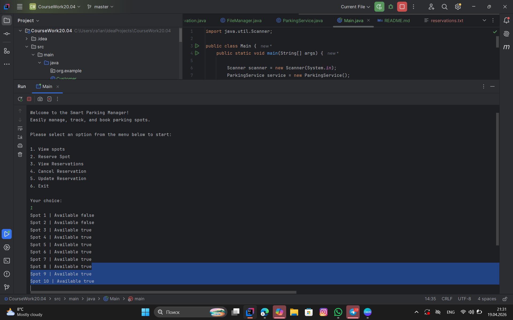
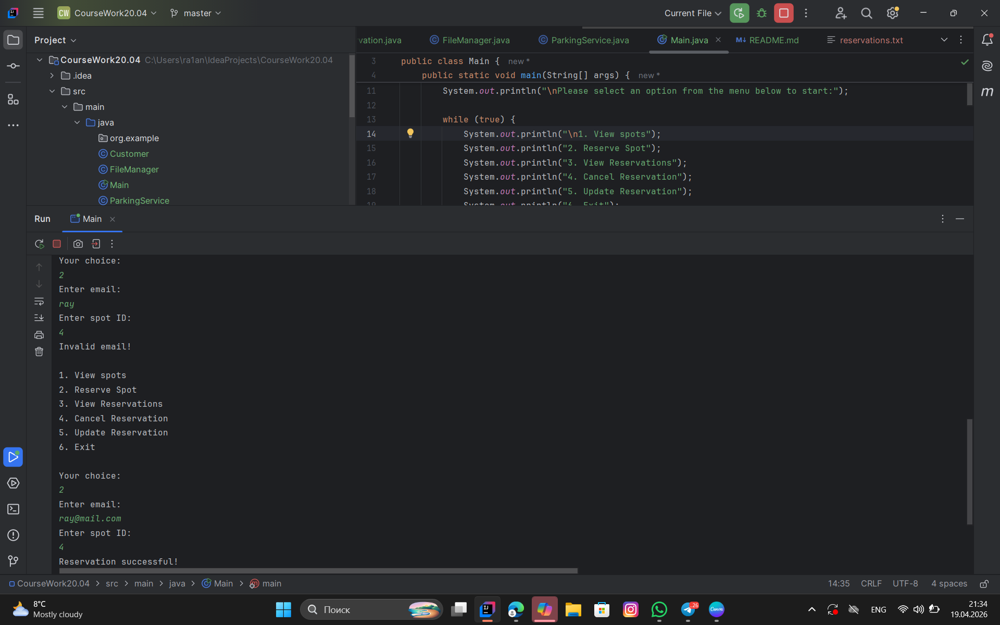
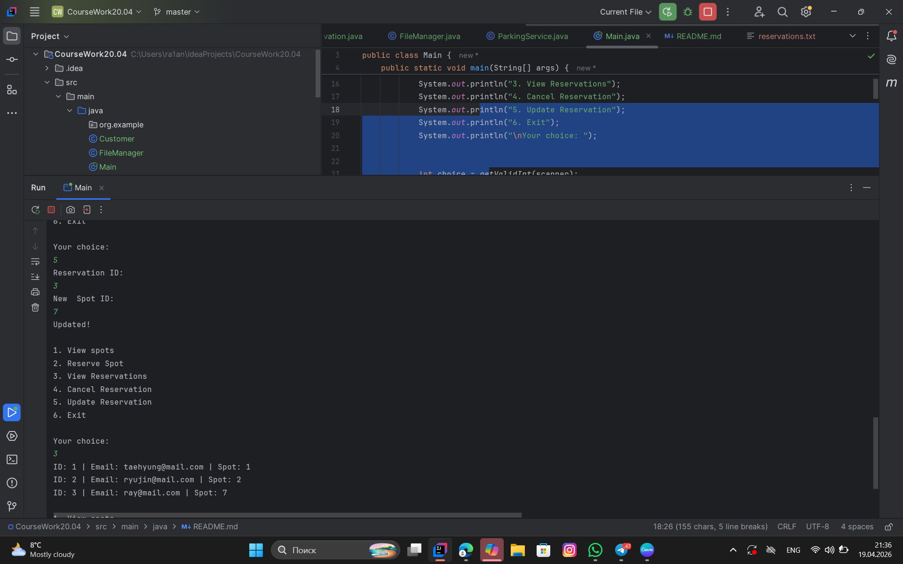

# Parking Reservation System
* Student Name: Cholponkulova Raiana
* Course: Programming Language ||
* Submission Date: April 2026

## Presentation Link
* You can view my project presentation here: [Presentation](https://canva.link/zmbeu6x6ukt0fy7)

---

## 1. Project Overview & Purpose
This is a Java-based Command Line Interface (CLI) application designed to automate the management of parking spaces. It allows administrators to track availability, manage bookings, and ensure data consistency through persistent storage.

## 2. Objectives
* **Automation:** To replace manual parking logs with a fast, digital system.
* **Data Integrity:** To prevent overbooking of spots using real-time validation.
* **Persistence:** To ensure all records are saved and can be exported for external use.
* **OOP Practice:** To demonstrate the use of Inheritance, Encapsulation, and Polymorphism in a real-world scenario.

---

## 3. Project Requirement List (10 Key Requirements)
1.  **Full CRUD:** Users can Create, Read, Update, and Delete reservations.
2.  **CLI Navigation:** Interactive menu-driven interface for easy use.
3.  **Input Validation:** System checks for valid emails (Regex) and prevents empty inputs.
4.  **Data Import:** Functionality to load data from `reservations.txt` on startup.
5.  **Data Export:** Functionality to export records to a standard **CSV format**.
6.  **Error Handling:** Use of `try-catch` to prevent crashes from invalid numeric inputs.
7.  **Encapsulation:** All data fields are `private` with public `getters/setters`.
8.  **Inheritance:** `Customer` class inherits from `User` to reuse core attributes.
9.  **Polymorphism:** Overriding the `displayInfo()` method to show specific data.
10. **Persistence:** Use of File I/O to store and retrieve data.

---

## 4. Documentation

### Algorithms and Data Structures
* **ArrayList:** Used for dynamic storage of Reservation objects in memory.
* **Synchronization Algorithm:** On startup, the system parses the CSV file and maps the status of each `ParkingSpot` (Occupied/Available) based on existing reservations.
* **Input Validation Logic:** A loop-based algorithm that re-prompts the user if an invalid data type is entered.

### Modules
* **Main:** Handles the user interface and menu logic.
* **ParkingService:** Contains business logic (CRUD operations).
* **FileManager:** Dedicated module for CSV Import/Export.
* **Models:** Classes representing `User`, `Customer`, `Spot`, and `Reservation`.

### Challenges Faced
* **Buffer Sync:** Managing the `Scanner` buffer when switching from `nextInt()` to `nextLine()`.
* **Data Integrity:** Ensuring that deleting a reservation correctly frees up the linked `ParkingSpot` object in the system.

---

## 5. Test Cases and Outputs

| Input Action | Sample Input | Expected Output | Status |
| :--- | :--- | :--- | :--- |
| **Add Booking** | email@test.com, Spot 5 | "Reservation successful!" | Validated |
| **Invalid Input** | "abc" instead of Spot ID | "Error! Please enter a number." | Validated |
| **Export Data** | Select Option 6 | "Data exported to export.csv successfully!" | Validated |

---

## 6. Verification Screenshots
*Note: All screenshots include the system date and time as required.*

